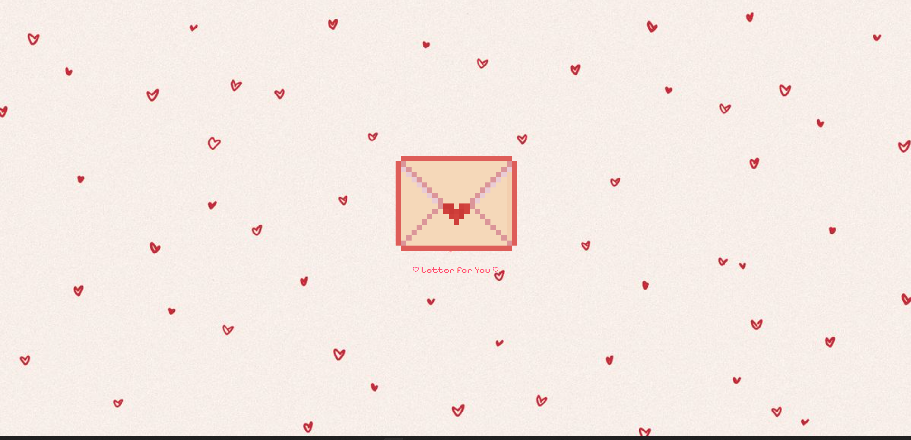

# Interactive Valentine Letter

A charming, interactive web-based Valentine's letter designed to deliver a special message with a touch of playfulness and many cute cats.

## Preview

| Letter | The Celebration |
| :----------------: | :-------------: |
|  |  |

## Project Structure

```bash
├── index.html          # Main page structure
├── script.js           # Interactive logic and heart animations
├── style.css           # Styling, transitions, and responsive design
├── Public/             # Static resources
│   ├── assets/         # Main assets (images, gifs, favicon)
│   │   ├── cat_heart.gif
│   │   ├── cat_dance.gif
│   │   ├── envelope.png
│   │   ├── yes.png
│   │   ├── no.png
│   │   ├── maybe.png
│   │   └── ... 
│   └── Screenshots/    # Demo images
└── README.md           # Project documentation
```

## How to Run

1. **Clone the Repository:**

   ```bash
   git clone https://github.com/toxicbishop/Valentine-Letter.git
   cd "Valentine Letter"
   ```

2. **Open the Project:**
   Simply open `index.html` in your favorite web browser or use a Live Server extension in VS Code.

## Assets Used

- `cat_heart.gif`: The greeting cat.
- `cat_dance.gif`: The celebratory cat.
- Custom pixel-art buttons (`yes.png`, `no.png`, `maybe.png`).
- `heart-bg.jpg`: Background image.
